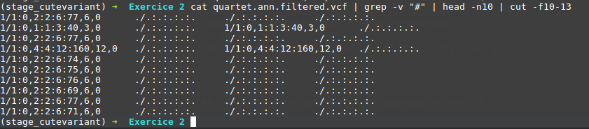
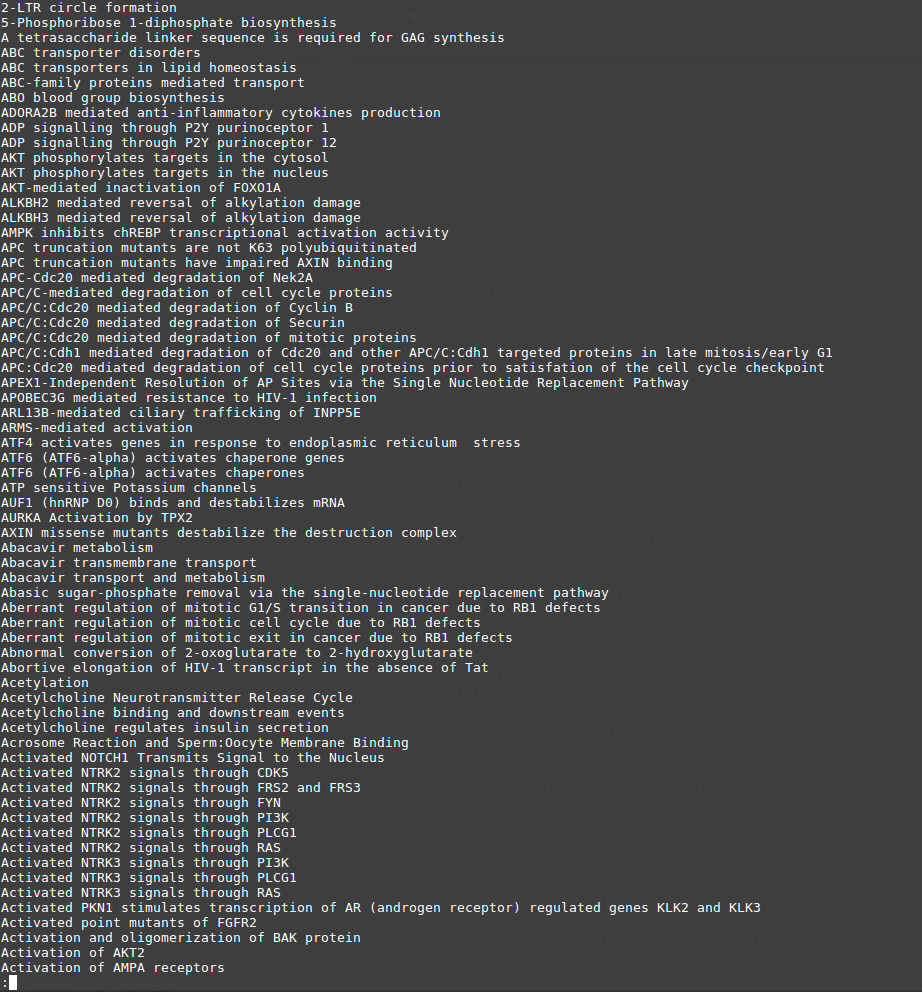
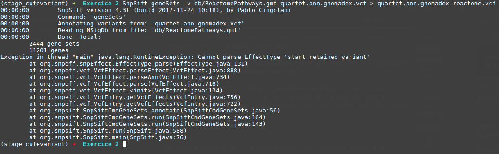
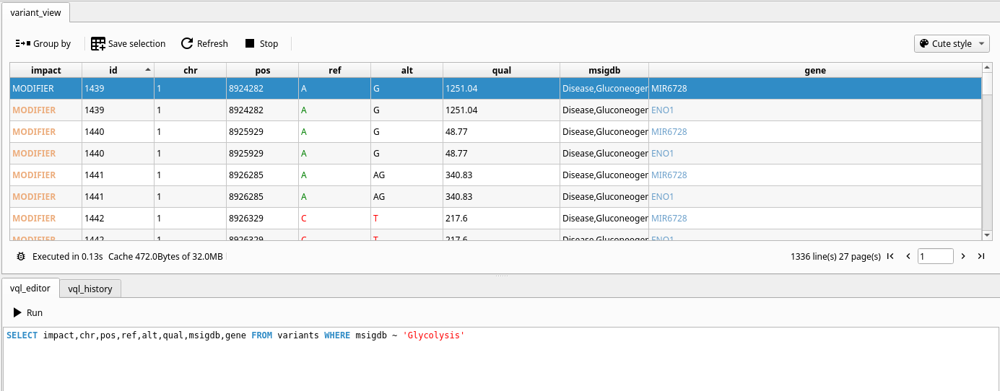
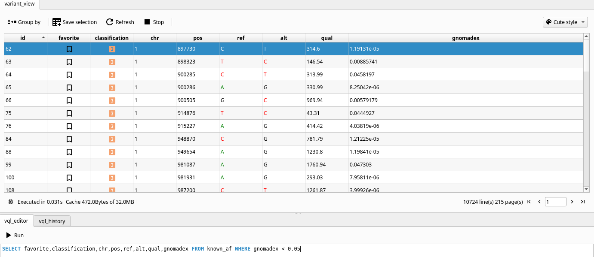

# Exercice 2 : Apprendre à annoter les variants

Cet exercice fait suite au premier, qui était de découvrir la chaîne fastq > sam > bam > vcf > vcf.gz (avec les indexations aux étapes intermédiaires).

Dans le précédent exercice, nous partions des fichiers de séquençage, et avons découvert les outils pour aligner les reads de séquençage avec un génome de référence (*E. coli* simplifié en l'occurence).

Un des aspects clés du premier exercice pour comprendre le fichier que nous utiliserons ici est qu'il est possible de rassembler dans un seul VCF les variants de plusieurs échantillons.

Dans cet exercice, le but sera de comprendre comment annoter des variants contenus dans un fichier VCF.

Pour cela, nous allons condenser dans ce TP cinq exemples.


- [Exercice 2 : Apprendre à annoter les variants](#exercice-2--apprendre-à-annoter-les-variants)
  - [TP snpEff](#tp-snpeff)
    - [Première étape: Annotation simple](#première-étape-annotation-simple)
      - [Annotation Gene Ontology](#annotation-gene-ontology)
    - [Deuxième étape: Comparer les variants dans une étude cas/contrôle](#deuxième-étape-comparer-les-variants-dans-une-étude-cascontrôle)
      - [Annotation Comparaison Cas/Contrôle:](#annotation-comparaison-cascontrôle)
    - [Troisième étape : filtrer les variants](#troisième-étape--filtrer-les-variants)
      - [Filtrage des variants sur la base de l'étude Cas/Contrôle](#filtrage-des-variants-sur-la-base-de-létude-cascontrôle)
      - [Filtrage plus précis des variants](#filtrage-plus-précis-des-variants)
    - [Pour aller plus loin](#pour-aller-plus-loin)
      - [Annoter avec des données cliniques](#annoter-avec-des-données-cliniques)
      - [Filtrage avec les annotations clinvar (basique)](#filtrage-avec-les-annotations-clinvar-basique)
      - [Filtrage plus avancé des variants (toujours annotés clinvar)](#filtrage-plus-avancé-des-variants-toujours-annotés-clinvar)
  - [TP cutevariant](#tp-cutevariant)
  - [Application pratique : Analyse d'un vrai exome](#application-pratique--analyse-dun-vrai-exome)
    - [Première étape : découverte du fichier](#première-étape--découverte-du-fichier)
    - [Seconde étape : annotation**s** du fichier](#seconde-étape--annotations-du-fichier)
    - [Troisième étape : filtrage des variants](#troisième-étape--filtrage-des-variants)
      - [Filtrage des variants *de novo*](#filtrage-des-variants-de-novo)
      - [Annotation des variants rares](#annotation-des-variants-rares)
      - [Filtrage des variants rares](#filtrage-des-variants-rares)
  - [Annotations métabolomiques (Reactome)](#annotations-métabolomiques-reactome)
    - [Découverte de la base de données Reactome](#découverte-de-la-base-de-données-reactome)
    - [Annotation des variants](#annotation-des-variants)
  - [Comprendre ce que font les annotateurs de VCF](#comprendre-ce-que-font-les-annotateurs-de-vcf)
  - [Les critères à utiliser pour prédire l'effet d'un variant](#les-critères-à-utiliser-pour-prédire-leffet-dun-variant)
  - [Quelques commandes utiles en vrac :](#quelques-commandes-utiles-en-vrac-)
    - [Combien de variants pour chaque chromosome ?](#combien-de-variants-pour-chaque-chromosome-)
    - [Récupérer les annotations d'un variant dans une base de données **immense**](#récupérer-les-annotations-dun-variant-dans-une-base-de-données-immense)


## TP snpEff
Ce TP est issu de https://pcingola.github.io/SnpEff/examples/ (en anglais)

Si il est facile d'installer snpEff...
```shell:
conda install snpEff
conda install snpSift
```

... ainsi que le génome humain de référence annoté, GRCh37.75 (aussi connu sous le nom de hg19)

```shell:
snpEff download -v GRCh37.75
```

... Le fichier ZIP du TP est introuvable au 6 mars 2021 (et [cette Issue](https://github.com/pcingola/SnpEff/issues/270) sur github est là depuis le 18 novembre 2020...)

Heureusement, @dridk m'a donné les fichiers du tutoriel !

### Première étape: Annotation simple

#### Annotation Gene Ontology
```shell:
SnpEff  -stats ex1.html GRCh37.75 chr7.vcf.gz
```

Le but de cette commande est:
- Produire un VCF annoté à partir de chr7.vcf.gz (qui s'appelera chr7.ann.vcf)
- Produire un rapport statistique en HTML, décrivant les variants dans leur ensemble. Ces statistiques sont directement issues des annotations produites par snpEff

Pour cela, snpEff a besoin du génome de référence, annoté. En l'occurence, GRCh37.75.

Enfin, nous lui donnons le fichier contenant les variants (issus des étapes précédentes, juste après séquençage), ici c'est chr7.vcf.gz.

Le fichier résultant, chr7.ann.vcf, contient, pour chaque variant, les échantillons qui le présentent, et, contrairement au VCF seul, l'effet dudit variant d'un point de vue fonctionnel. Il existe plusieurs types d'impact, par exemple une mutation non-sens (codon stop prématuré), une mutation faux-sens (substitution d'un acide aminé par un autre) ou bien ne pas avoir d'impact du tout (grâce à la redondance du code génétique). Bien sûr, ce ne sont que des exemples, en considérant uniquement les séquences traduites et seulement sur l'aspect structurel d'une protéine codée. En effet, certaines mutations peuvent impacter la traduction, par exemple si la mutation entraîne l'apparition d'un codon rare. Dans ce cas, une mutation dite silencieuse car conservant l'acide aminé sera passée sous silence par ce type d'études incomplète. Bien sûr, snpEff permet une analyse plus poussée en se basant notamment sur la littérature (ce que contient le génome de référence annoté).

Ci-dessous, un extrait (très résumé) de l'analyse statistique automatique telle qu'effectuée par snpEff.


Ce qui nous intéresse, c'est notamment le rapport entre le nombre de mutations faux-sens et le nombre de mutations silencieuses. Dans notre cas (voir figure ci-dessous), ce ratio est proche de 1. (comment l'interpréter ? Je ne sais pas).


### Deuxième étape: Comparer les variants dans une étude cas/contrôle

Nous allons utiliser SnpSift pour identifier les variants avec le plus d'impact, en fournissant un fichier de pedigree, c'est-à-dire un arbre généalogique des individus concernés par l'étude. Ainsi, en connaissant le mode de transmission de la maladie considérée (ici un caractère récessif autosomal), SnpSift pourra filtrer les variants de manière à garder uniquement ceux dont les caractères sont compatibles avec ce pedigree.

#### Annotation Comparaison Cas/Contrôle:
```shell
SnpSift caseControl -v -tfam pedigree.tfam chr7.ann.vcf > chr7.ann.cc.vcf
```

Cette commande a pris environ trois minutes (contrairement au tuto sur lequel est basé ce rapport qui avertit de 60 minutes d'exécution). C'est sans doute parce que dans l'énoncé initial, il était question des chromosomes 7 et 17, tandis que dans cet exemple, il n'y avait que le 7.

Comme d'habitude, jetons un coup d'oeil au fichier obtenu. Comme il est long, commençons par compter les lignes de données (c'est-à-dire en ignorant les lignes commençant par #). Pour cela, comparons

```shell
cat chr7.ann.cc.vcf |  wc -l
```
Résultat : 494 196, avec
```shell
cat chr7.ann.cc.vcf | grep -v "^#" | wc -l
```
Résultat : 494 161. Conclusion, il n'y a que 35 lignes de métadonnées et plusieurs centaines de milliers de variants. Comment s'y retrouver ? En réalité, parmi cette masse de variants, très peu ont une part significative dans la maladie.

Il suffit de regarder une simple statistique pour le voir. En effet, si on affiche le premier variant :

```shell:
cat chr7.ann.cc.vcf | grep -v "^#" | head -n1
```
Voici ce que l'on obtient

```
7	16487	.	G	T	.	.	AC=9;AN=9;ANN=T|intergenic_region|MODIFIER|CHR_START-AC093627.7|CHR_START-ENSG00000232325|intergenic_region|CHR_START-ENSG00000232325|||n.16487G>T||||||;Cases=0,0,0;Controls=4,0,9;CC_TREND=NaN;CC_GENO=NaN;CC_ALL=1,000e+00;CC_DOM=1,000e+00;CC_REC=1,000e+00	GT	1|1	.	.	.	.	1|1	.	.	.	.	.	1|.	.	1|1	1|1	.	.
```

Ce qui est parfaitement illisible. Mais la statistique qui nous intéresse dans cette exemple, c'est celle-ci:

```;Cases=0,0,0;Controls=4,0,9;```

Ce qui signifie que ce variant est retrouvé, chez les témoins, 4 fois à l'état homozygote, 0 fois à l'état hétérozygote, et que ce locus possède 9 allèles (différents de la référence) au total chez les témoins. Pour les cas, la signification est bien entendu la même.

En plus, ce VCF annoté CC (cas/contrôle, control/case en anglais) présente également plusieurs autres statistiques utiles pour les outils d'analyse que nous allons utiliser par la suite.

### Troisième étape : filtrer les variants

Petit résumé des étapes précédentes, depuis le fastq.

- **fastq > sam** : aligner les reads de séquençage de façon à leur donner des coordonnées par rapport au génome de référence
- **sam > bam** : trier et indexer les alignements, et sortir le fichier résultant sous une forme binaire indexée (plus rapide à parcourir)
- **bam > vcf** : Grâce à freebayes, identifier les variants (variant calling). Cette étape permet de densifier l'information: au lieu de stocket les 3 milliards de nucléotides que compte le géome humain, le VCF se contente de noter les différences entre l'échantillon et la séquence de référence.
- **vcf > vcf.gz** Compresser le VCF avec bgzip, et indexer l'archive pour en accélérer la lecture.
- **vcf > ann.vcf** : C'était la première étape de cet exercice. Il s'agit de relier les variants (c'est-à-dire les loci avec au moins un allèle différent par rapport à la référence), et leur fonction biologique. En effet, on peut déjà distinguer les variants qui affectent une région non transcrite de variants qui affectent un transcrit. Parmi elles, on retrouve les régions introniques (qui sont transcrites puis excisées) des régions exoniques (qui se trouvent dans l'ARN messager). Ensuite, cet ADN messager est traduit en protéine, sauf les régions 5'UTR et 3'UTR (qui flanquent la séquence codante). On peut alors s'intéresser aux différents effets de ces mutations à partir de connaissances biologiques. Et si à première vue, un variant qui n'affecte pas directement la traduction peut être classé comme sans effet, la littérature peut affiner les conclusions, notamment si la mutation cause un site d'épissage alternatif : le plus souvent, la protéine est rapidement tronquée.
- **ann.vcf > ann.cc.vcf** : Cette étape permet d'enrichir de données statistiques chaque variant détecté. Pour cela, on utilise l'outil SnpSIFT afin de comparer entre eux les allèles dans un test cas/contrôle. L'idée est de donner pour chaque allèle de chaque variant, sa fréquence parmi les individus sains *vs* sa fréquence chez les individus malades. À cela s'ajoute le nombre total d'allèles (sur l'ensemble des échantillons) pour ce locus, ainsi que des tests statistiques de Fisher et de Cochran-Armitage. Pour ces derniers, la valeur p est indiquée pour chaque variant, correspondant à la probabilité d'avoir juste en considérant que le variant n'est pas lié à la maladie.

Maintenant, l'objectif est de filtrer ces centaines de milliers de variants, la plupart n'ayant *a priori* aucun rôle dans la maladie étudiée.

Pour cela, nous utilisons encore SnpSift, cette fois avec le scénario 'filter'.

#### Filtrage des variants sur la base de l'étude Cas/Contrôle
```shell:
cat chr7.ann.cc.vcf | SnpSift filter "(Cases[0] = 3) & (Controls[0] = 0)" > chr7.filtered.hom.vcf
```
Cette commande va donner le contenu du VCF annoté enrichi à la fonction filter de SnpSift. Cette dernière a besoin du critère, sous forme d'une chaîne de caractères. Cette dernière contient une expression booléenne qui agit comme un prédicat sur chacun des variants du fichier. Si l'expression évalue à vrai pour un variant, ce dernier est conservé et passe dans stdout, puis le suivant est lu. Sinon, il ne passe pas dans stdout. Dans notre cas, la sortie standard est redirigée vers chr7.filtered.hom.vcf.

À l'issue de cette commande, on se retrouve avec un VCF avec...

```shell:
cat chr7.filtered.hom.vcf | wc -l
```
441 lignes !

Bon, en enlevant les headers et les infos en tout genre, on a...
```shell:
cat chr7.filtered.hom.vcf | grep -v "^#" | wc -l
```
404 lignes. C'est toujours trop.

Pour rappel, voici l'expression que nous avions utilisée:

"(Cases[0] = 3) & (Controls[0] = 0)"

On cherchait donc les variants présents dans les 3 échantillons malades mais jamais chez les témoins.

Le problème, c'est que certains variants peuvent se retrouver, par hasard, seulement chez les malades. Exemple tout bête, puisque c'est une maladie autosomale récessive, les malades reçoivent chacun un chromosome 'malade' de chacun de leurs parents. Comme les parents ne sont pas malades, les enfants malades ont forcément tous les trois la même paire de chromosomes porteurs de la maladie. Donc si ils héritent tous les trois des deux mêmes chromosomes, ils héritent aussi de tous les variants qui viennent avec. D'où le nombre potentiellement élevé de variants correspondant au critère plutôt simpliste présenté plus haut.

Il faut donc affiner le filtre. C'est l'objet de cette commande:

#### Filtrage plus précis des variants
```shell:
cat chr7.ann.cc.vcf | SnpSift filter "(Cases[0] = 3) & (Controls[0] = 0) & ((ANN[*].IMPACT = 'HIGH') | (ANN[*].IMPACT = 'MODERATE'))" > chr7.filtered.vcf
```

Même commande, nouveau filtre. On retrouve la condition précédente (variant seulement chez les malades et tous les malades), agrémenté de deux conditions supplémentaires. On cherche dans le champ ANN (annotations). On veut trouver seulement les variants avec un impact HIGH ou MODERATE.

Avec ça, on a un VCF bien plus lisible:

```shell:
cat chr7.filtered.vcf | wc -l
```

38, seulement ! Mais un gros header.

```shell:
cat chr7.filtered.vcf | grep -v "^#" | wc -l
```

1, juste Un. Un seul variant potentiellement pathogène selon les critères vus précédemment (Présents chez tous les malades, aucun des contrôles, impact modéré à fort).

On peut même lire la dernière ligne, le plus simple est de lire l'annotation:

```ANN=T|stop_gained|HIGH|CFTR|ENSG00000001626|transcript|ENST00000003084|protein_coding|12/27|c.1624G>T|p.Gly542*```

On peut voir notamment 'stop_gained', ce qui veut dire qu'il s'agit d'une mutation non-sens. Ce genre de mutation a très souvent un fort impact (à moins qu'il ne touche les derniers acides aminés, et encore).

On sait aussi que c'est à la position 1624 du transcrit, une mutation G>T. La conséquence est précisée juste après dans l'annotation: Gly542* signifie que c'est une glycine qui a été remplacée par un codon stop à cause de cette mutation. Or, sur une protéine de 1482 acides aminés, une telle troncature rend la protéine complètement inactive physiologiquement. Les individus malades sont donc atteints de la mucoviscidose.

### Pour aller plus loin

Les étapes précédentes consistaient à trouver un variant responsable d'une maladie génétique sans autre a priori que des annotations fonctionnelles de référence (donc non pathogènes).

Dans la pratique, les médecins disposent de bases de données de maladies génétiques et de variants connus. Le plus souvent, donc, les variants du patients ont déjà été annotés comme pathogène. Et c'est la dernière étape de ce premier TP: Utiliser une base de données de variants pathogènes connus pour annoter le VCF du patient.

Nous allons donc utiliser ClinVar (une base de données en VCF), et SnpSift.

#### Annoter avec des données cliniques
```shell:
SnpSift annotate -v db/clinvar.vcf.gz chr7.vcf.gz > chr7.clinvar.vcf
```

Ici, contrairement au tuto, j'ai voulu constater l'effet de cette annotation sur le fichier VCF originel, avant annotation et enrichissement avec les statistiques Cas/Contrôle.

Avec cette commande,

```shell:
SnpSift annotate -v db/clinvar.vcf.gz chr7.ann.cc.vcf > chr7.ann.cc.clinvar.vcf
```
Le résultat est similaire, seulement le fichier résultant est plus annoté que dans le cas précédent. En effet, on se retrouve avec les annotations de référence (.ann), les annotations qui comparent statistiquement les cas et les contrôles (.cc) et enfin les annotations cliniques grâce à clinvar (.clinvar).

Tandis que le précédent a seulement les annotations clinvar.

Néanmoins, si on compare les deux fichiers VCF résultant des commandes précédentes, on se rend compte que le nombre de variants est le même (ce qui est attendu puisqu'aucun de ces VCF n'a été filtré à ce stade).


Maintenant que clinvar a permis d'annoter ces deux VCF, nous allons pouvoir les filtrer pour conserver uniquement les variants annotés comme pathogènes par clinvar.

#### Filtrage avec les annotations clinvar (basique)
Pour commencer, voici le nombre de variants qui ont une signification clinique selon clinvar:
```shell:
cat chr7.ann.cc.clinvar.vcf | SnpSift filter "(exists CLNSIG)" | wc -l
```
Résultat: 1122

C'est toujours trop. Mais essayons, pour mieux comprendre le contenu de ce VCF, d'afficher le premier variant annoté avec CLNSIG (on a vu dans la commande précédente qu'il y en avait 1122).

Pour lire plus facilement le VCF, on peut utiliser ce fichier qui fait partie du repo SnpEff (que je n'avais pas téléchargé en entier)

```shell:
curl get "https://raw.githubusercontent.com/pcingola/SnpEff/master/scripts/vcfInfoOnePerLine.pl" > vcfInfoOnePerLine.pl;
chmod +x vcfInfoOnePerLine.pl
```
dans un dossier scripts par exemple.

Et pour l'utiliser,

```shell:
cat chr7.ann.cc.clinvar.vcf | SnpSift filter "(exists CLNSIG)" | grep -v "^#" | head -n1 | scripts/vcfInfoOnePerLine.pl
```

Ici, on applique le filtre (clinvar l'a annoté avec une signification clinique, CLNSIG), puis on supprime les headers et autres info (avec grep), puis on prend la première ligne (head -n1) et enfin on affiche la ligne en question avec une info par ligne.

Par exemple, pour retrouver tous les variants qui affectent CFTR, on peut entrer:

#### Filtrage plus avancé des variants (toujours annotés clinvar)
```shell:
SnpSift Filter '(exists CLNDN) & (ANN[*].EFFECT has 'stop_gained') & (ANN[*].GENE = 'CFTR')'
```
Dans le tuto, c'est ```(exists CLN**B**N)```, seulement ce champ a manifestement été remplacé dans les nouvelles versions de clinvar par CLNDN. L'essentiel, c'est que ça marche.

Seulement, ce genre de requête est très spécifique, si on veut sélectionner tous les variants pathogènes, il faut aussi connaître le nom du champ ()

## TP cutevariant

Avec cutevariant, il suffit d'ouvrir le fichier VCF annoté (chr7.ann.cc.clinvar.vcf) produit à [cette étape](#pour-aller-plus-loin), le fichier de pedigree (pedigree.tfam), et de sélectionner les champs qui nous intéressent. Avec le fichier annoté par clinvar, c'est le champ CLNSIG qui nous informe sur l'importance clinique du variant. En plus, cutevariant a le bon goût de nous indiquer l'ensemble des valeurs prises par le champ CLNSIG. On peut donc utiliser l'option 'grouper par' et choisir 'CLNSIG' (si il est au moins présent dans la requête). Il devient alors possible de découvrir tous les variants connus dans le VCF.


## Application pratique : Analyse d'un vrai exome

Pour cette dernière partie pratique, nous allons examiner un exome issu du séquençage de véritables patients. On peut le retrouver à [cette adresse](https://figshare.com/articles/dataset/Corpasome/693052?file=3083423).

Pour analyser un génome, quel qu'il soit, il faut d'abord poser une série de questions à laquelle on souhaite répondre. Dans notre cas, nous allons tenter d'identifier les conséquences cliniques des variants répertoriés dans ce fichier. Voici les principaux objectifs :

~~- Analyse descriptive (nombre de variants dans un exome, leur génotype, fréquences alléliques).~~
~~- Identification des variants, description la plus exhaustive possible à l'aide des outils d'annotation.~~
~~- Description exhaustive des gènes impliqués à partir d'annotations de la littérature.~~

- Récupérer tous les variants avec un impact HIGH
- Récupérer les variants *de novo*, c'est-à-dire présents chez les enfants mais pas les parents.
- Récupérer les variants rares dans la population
- Récupérer les variants des gènes impliqués dans la glycolyse

Pour cela, nous allons utiliser les outils présentés plus haut, à savoir SnpEff, SnpSift, et cutevariant.

### Première étape : découverte du fichier

Il s'agit d'un VCF, manifestement annoté (il termine par .variants.**annotated**.vcf).
Jetons un coup d'oeil aux champs qui s'y trouvent:

```shell:
cat quartet.variants.annotated.vcf | grep "^#[^#]"
```

Ce qui donne:

```#CHROM	POS	ID	REF	ALT	QUAL	FILTER	INFO	FORMAT	ISDBM322015	ISDBM322016	ISDBM322017	ISDBM322018```

On peut donc voir que ce VCF contient 4 échantillons. Et si on l'ouvre avec cutevariant, ce dernier va importer le champ INFO/EFF en un seul morceau, sans séparer les champs contenus dans EFF. Cela est dû à l'utilisation d'une ancienne version de SnpEff, qui produit des annotations que cutevariant ne supporte pas.

### Seconde étape : annotation**s** du fichier

Donc, nous devons refaire l'annotation si nous voulons que cutevariant les prenne en charge. Pour cela, le plus simple est avec bcftools. Voici la commande :

```shell:
bcftools annotate -x INFO/EFF quartets/quartet.variants.annotated.vcf > quartet.vcf
```

Cette commande efface (-x) le champ EFF de la colonne INFO (pour chaque variant) et stocke la sortie résultante dans le fichier quartet.vcf (notez que j'ai supprimé le suffixe annoted car il n'y a presque plus d'annotations).

On ne peut pas laisser ce fichier comme ça, il faut annoter. Alors annotons. Pour cela, nous allons faire un fichier VCF qui contient non seulement les annotations de gene ontology (ce que fait SnpEff par defaut). Donc on annote avec SnpEff, en prenant soin d'utiliser hg19 (le génome qui a servi à faire le Variant Calling).

```shell:
snpEff hg19 quartet.vcf -Xmx8G > quartet.ann.vcf
```

Cette commande va annoter quartet.vcf. Le résultat sera écrit dans quartet.ann.vcf. J'ai eu une erreur de dépassement de mémoire la première fois que j'ai exécuté cette commande, donc si vous utilisez les mêmes fichiers que moi, je conseille vivement d'augmenter la taille de RAM allouée à snpEff (ici -Xmx8G pour 8GB de RAM).

Grâce à cette annotation, nous allons pouvoir extraire du VCF tous les variants qui ont un impact HIGH ! Voir [cette section]() pour voir comment s'y prendre avec cutevariant.


### Troisième étape : filtrage des variants

Et si nous cherchions des mutations *de novo* ? Dans notre cas, intéressons-nous aux mutations qui sont **potentiellement** apparues lors de la transmission du matériel génétique des parents à l'enfant (c'est-à-dire dans la lignée germinale des parents, ou avant la première division du zygote).

Pour cela, nous allons utiliser SnpSift, qui permet de filtrer les variants selon des critères définis.

Donc, si on veut seulement les variants qui se trouvent chez les enfants mais pas chez les parents (sans se soucier de la ploïdie):

#### Filtrage des variants *de novo*
```shell:
cat quartet.ann.vcf | SnpSift filter "((GEN[1].GT='./.') & (GEN[3].GT='./.')) & ((GEN[0].GT != './.') | (GEN[2].GT != './.'))" > quartet.ann.filtered.vcf
```

Bon, cette expression peut faire un peu peur de prime abord. Mais elle est relativement simple en réalité. Décomposons.

GEN[0] représente la colonne SAMPLE[0]. Grâce au site du téléchargement, on sait que:

```
ISDBM322015: Son
ISDBM322016: Father
ISDBM322017: Daughter
ISDBM322018: Mother
```
[source](https://figshare.com/articles/dataset/Corpasome/693052?file=3083423)

Donc GEN[0] (ou SAMPLE[0], c'est la même chose) contient le génotype du fils.
On veut le génotype (GT) donc on y accède avec le '.' (GEN[0].GT).
Dans notre expression totale, on chaîne les opérations 'ET' et 'OU'. En effet, on veut que :

1- les parents (GEN[1] ET GEN[3]) soient homozygotes REF/REF (noté ./.).
2- au moins un des enfants (GEN[0] OU GEN[2]) ne soit pas homozygote REF/REF (donc on veut != ./.).
3- Enfin, pour compléter la formule, il faut que les deux conditions précédentes soient vraies en même temps

Pour tester le filtre, rien de plus simple:

```shell:
cat quartet.ann.filtered.vcf | grep -v "#" | head -n10 | cut -f10-13
```


#### Annotation des variants rares
```shell:

```

#### Filtrage des variants rares
```shell:

```

## Annotations métabolomiques (Reactome)

Pour prédire l'impact fonctionnel d'un variant sur la physiologie de son porteur, il peut être judicieux de l'annoter selon des données de métabolomique. En effet, si une mutation affecte un gène impliqué dans une voie métabolique connue, la probabilité que ce variant ait des conséquences physiologiques s'en voit fortement augmentée. Heureusement, il existe une base de données qui répertorie la plupart des voies métaboliques connues, celle que nous utiliserons ici s'appelle Reactome. Elle peut être téléchargée [à cette adresse](https://reactome.org/download-data), ou en suivant directement [ce lien](https://reactome.org/download/current/ReactomePathways.gmt.zip).


### Découverte de la base de données Reactome
Découvrons ensemble la base de données.
Par exemple, avec un 'less', on peut voir que c'est un fichier séparé par des tabulations.

```shell:
less ReactomePathways.gmt
```

Et si on essaye d'isoler les colonnes avec cut,

```shell:
cat ReactomePathways.gmt | cut -f1 | less
```



Cette commande nous a affiché la première colonne de ```Reactome.gmt```. Chaque ligne de cette première colonne contient le nom de la voie métabolique. Ensuite, comme nous allons le montrer avec les commandes suivantes, il y a autant de colonnes que de gènes impliqués dans la voie métabolique répertoriée. C'est donc un fichier avec un nombre de colonnes très variables.

Par exemple, avec cette commande:

```shell:
cat ReactomePathways.gmt | cut -f3 | less
```

On affiche la troisième colonne. Et ainsi de suite. À compter de la colonne 5, on commence à voir des lignes vides. Ce qui veut dire que la voie métabolique décrite à la ligne correspondante n'a que 3 gènes connus impliqués. Donc pour s'amuser, on peut entrer -f100 pour le cut. Une voie métabolique peut-elle impliquer 100 gènes ? Spoiler : oui. Exemple : ```SEL1L``` (ne pas le mettre en lettre minuscules...).

Pour savoir dans quelle voie métabolique il est impliqué, il suffit de faire un grep dessus. Comme ceci:

```shell:
cat ReactomePathways.gmt | grep "SEL1L" | cut -f1
```

J'ai fait un cut -f1 car tout ce qui nous intréresse c'est le nom de la voie métabolique en question, et pas les 100 gènes impliqués.

Ce qui nous donne:


Si on trouve autant de voies métaboliques, c'est parce que la recherche était un peu maladroite. Ce qui nous intéresse, c'est quelle(s) voies métaboliques ont plus de 100 gènes impliqués. Là, j'ai fait l'inverse. J'ai trouvé le nom d'un gène impliqué dans une voie métabolique très complexe (100 gènes), et j'ai cherché dans quelles autres voies métaboliques il était impliqué. Ce genre de raisonnement absurde doit tout de même amener à plus de vigilance, et il y a toute une gymnastique intellectuelle pour ne pas tomber dans le piège.

Donc, si on veut classer les voies métaboliques, de celle avec le plus de gènes connues à celle avec le moins de gènes connus, on peut utiliser cette commande (le script python est fourni).

```shell:
cat ReactomePathways.gmt | tr "\t" "," | python "../Rapport Exercice 2/read_gmt.py" | sort -n -r | head -n10
```

Le résultat est... surprenant (et en même temps pas tant que ça)


C'est la transduction du signal qui est la mieux annotée, ce qui n'est pas très étonnant car c'est une famille de processus cellulaires parmi les mieux étudiés, notamment en cancérologie. De même pour le métabolisme et le système immunitaire. Le problème, c'est que les noms qui sortent en premier (les voies cellulaires qui ont le plus de gènes connus associés) sont très vagues. La transduction du signal intervient en effet dans de très nombreuses voies, à chaque fois qu'une cellule a besoin d'intégrer un signal.

Quelques commandes à tester pour s'amuser:

Pour avoir le nombre de gènes annotés comme faisant partie du cycle de Krebs (aussi appelé cycle de l'acide citrique)
```shell:
cat ReactomePathways.gmt | tr "\t" "," | python "../Rapport Exercice 2/read_gmt.py" | grep "citric"
```

Pour avoir le nombre de gènes annotés comme faisant partie de la glycolyse
```shell:
cat ReactomePathways.gmt | tr "\t" "," | python "../Rapport Exercice 2/read_gmt.py" | grep "Glycolysis"
```

### Annotation des variants

Maintenant que nous avons bien compris les données d'annotation (une colonne avec une voie cellulaire, et toutes les autres contenant des noms de gènes), nous allons pouvoir passer à l'annotation à proprement parler. Le VCF que nous allons utiliser ne sera rien d'autre que ```quartet.ann.gnomadex.vcf```, généré dans les étapes précédentes.

Si on veut annoter ```quartet.ann.gnomadex.vcf```, il faut exécuter cette commande avec SnpSift :
```shell:
SnpSift geneSets -v db/ReactomePathways.gmt quartet.ann.gnomadex.vcf > quartet.ann.gnomadex.reactome.vcf 
```
Mais avec une version un peu ancienne de SnpSift (merci les dépôts Linux Mint 18...), il est possible d'avoir ce genre d'erreur (pour peu que l'annotateur que vous aviez utilisé était trop récent).



SnpSift nous informe que l'erreur est minuscule, c'est seulement **une** annotation qu'il n'arrive pas à analyser. C'est d'ailleurs très facile à vérifier. Et ça commence par un grep. Essayons d'enlever TOUTES les lignes incriminées, celles susceptibles de lancer cette erreur. C'est un peu de la triche, mais voyons tout de même l'impact d'une telle modification sur le fichier.

Donc, après avoir copié le nom de l'annotation problématique, nous pouvons créer un fichier VCF qui ne causera plus de tort à SnpSift. C'est un filtrage, en quelque sorte. Un filtrage, oui, mais c'est un peu triché. Donc la manoeuvre apparaîtra dans le nom du fichier résultant.

```shell:
cat quartet.ann.gnomadex.vcf | grep -v "start_retained_variant" > quartet_cheat.ann.gnomadex.vcf
```

Après, si on compare les deux fichiers (avant/après filtrage), on voit que l'erreur ne tenait qu'à **une** ligne du VCF d'entrée. La preuve en images:


Donc on peut annoter tranquillement, maintenant que ce bug a été mis sous le tapis (où se cachent la plupart des insectes en règle général).

Voici la commande, la marque de l'astuce est restée :

```shell:
SnpSift geneSets db/ReactomePathways.gmt quartet_cheat.ann.gnomadex.vcf > quartet_cheat.ann.gnomadex.reactome.vcf
```

On peut maintenant ouvrir le VCF résultant dans cutevariant, et voir tous les variants concernant la glycolyse. Pourquoi la glycolyse ? Parce qu'on peut. Et que c'était demandé dans l'exercice. Donc ci-dessous, le résultat:



Pour afficher les variants qui touchent la glycolyse, j'ai utilisé le champ 'msigdb' créé par SnpSift après annotation avec Reactome. La condition que je lui applique (```msigdb ~ "Glycolysis"```) signifie que je veux seulement les variants qui contiennent "Glycolysis" dans le champ msigdb. Petit problème, ou plutôt petit bug à corriger dans les prochaines versions : cutevariant ne lit pas correctement les annotations "msigdb" produites par ma version de SnpSift...

## Comprendre ce que font les annotateurs de VCF

Un annotateur de VCF a pour objectif d'associer à chaque variant un ensemble de descriptions, le plus souvent fonctionnelles. La plupart des annotateurs ne fournissent pas les propriétés intrinsèques du variants (chr, ref et alt sont plus de la responsabilité des 'variant callers'). Ces propriétés intrinsèques permettent d'identifier un variant de manière unique, en décrivant la différence entre l'échantillon considéré et la séquence de référence. Une fois identifié, l'annotateur a pour objectif de donner des informations supplémentaires sur l'impact dudit variant sur la génétique de l'individu porteur. Généralement, on s'intéresse aux conséquences physiologiques sur le patient, comme par exemple prédire une résistance aux anticancéreux à partir du génome d'une tumeur.

Pour annoter un VCF, il faut avoir une idée de la question posée (voir [la partie suivante](#les-critères-à-utiliser-pour-prédire-leffet-dun-variant)).

Un annotateur a besoin d'une base de données, qui répertorie un ensemble de caractéristiques (les annotations) accompagnées des coordonnées génétiques de celles-ci. Par exemple, clinvar répertorie un ensemble de variants (identifiés par ses propriétés intrinsèques), et les annotations correspondent aux conséquences cliniques du variant identifié.

Autre exemple, la base de données 'réactome' qui répertorie les principaux pathways métaboliques connus et les gènes impliqués. Ce dernier exemple nécessite une concordance entre le fichier VCF qui doit être annoté au moins avec des noms de gènes, et d'autre part le gène identifié dans le VCF qui doit être connu dans la base 'réactome'. Si les deux concordent, le VCF est enrichi d'informations sur les voies métaboliques dans lesquelles est impliqué chaque variant.

## Les critères à utiliser pour prédire l'effet d'un variant

Un annotateur de VCF a pour rôle de décrire chaque variant selon les informations dont il dispose. En effet, l'annotation d'un variant dépend de ce que le généticien souhaite savoir, ainsi que de l'information de référence. On peut trier les annotations selon le critère retenu (inspiré d'une liste fournie par @dridk):

- Critère de transmissibilité et hérédité. Ce type d'annotation est lié au pedigree, et permet de comparer les individus dans une étude cas/contrôle. Il ne nécessite aucune connaissance fonctionnelle sur le locus concerné (pas d'*a priori*). Pour annoter un VCF selon ces critères:
  ```shell
  SnpSift caseControl -v -tfam pedigree.tfam chr7.ann.vcf > chr7.ann.cc.vcf
  ```
  Plus d'infos dans [cette sous-section](#annotation-comparaison-cascontrôle)
- Critère d'impact sur la protéine. Ce type d'annotation nécessite un génome de référence contenant les annotations fonctionnelles pour chaque locus connu (région transcrite/intergénique, séquence codante/UTR, ...). L'idée de ce genre d'annotation est de suspecter un effet selon la ou les fonctions génétiques au locus considéré. Pour annoter un VCF selon ces critères:
  ```shell:
  SnpEff  -stats ex1.html GRCh37.75 chr7.vcf.gz
  ```
  Plus d'infos dans [cette sous-section](#annotation-gene-ontology)
- Critère lié à la littérature (connaissances des maladies génétiques). On utilise une base de données de génétique, qui répertorie chaque variant connu et les arguments cliniques qui vont avec. On peut même y trouver des études de biologie moléculaires et des modèles animaux qui confirment l'impact fonctionnel du variant considéré. C'est le type d'annotation le plus spécifique, mais le moins sensible. Spécifique, car si un variant documenté se trouve dans le génome du patient, il sera forcément annoté avec toutes les connaissances actuelles. Moins sensible, car un variant pathogène inconnu jusqu'alors ne sera pas détecté par ce genre d'annotations. C'est là qu'entrent en jeu les méthodes de découverte de nouveeaux variants, voir ci-dessus et ci-dessous. Pour annoter un VCF selon ces critères:
  ```shell:
  SnpSift annotate -v db/clinvar.vcf.gz chr7.vcf.gz > chr7.clinvar.vcf
  ```
  Plus d'infos dans [cette sous-section](#annoter-avec-des-données-cliniques)


## Quelques commandes utiles en vrac :

Ici, je pose les commandes qui ne s'inscrivent dans aucune véritable activité de recherche à proprement parler, mais qui peuvent être utiles pour avoir un bref aperçu de ses données.


### Combien de variants pour chaque chromosome ?

```shell:
cat quartet.ann.vcf | grep -v "#" | cut -f1 | uniq -c
```

Explication: rediriger quartet.ann.vcf vers la sortie standard (comme toujours). Ensuite, montrer seulement les lignes **sans** '#' (les variants typiquement). Enfin, cut vient prendre seulement la première colonne, et uniq -c compte le nombre de lignes différentes et leur valeur. Ici, comme on a sélectionné seulement la première colonne (CHR dans un VCF), on s'est retrouvé avec le nom des chromosomes de chaque variant. Comme il y a un nombre limité de chromosomes dans un exome, on peut se représenter le taux de variants en variant/Mégabases pour chaque chromosome.

### Filtrer uniquement les variants référencés dans dbSNP

```shell:
cat quartet.ann.vcf | SnpSift Filter  "(DB==true)" > quartet.ann.insnpdb.vcf
```

Avec ce filtrage, on se débarasse des variants qui n'ont pas d'annotation dans dbSNP.

### Récupérer les annotations d'un variant dans une base de données **immense**

Le but du jeu est de récupérer les annotations d'exome sur gnomAD sans télécharger la BDD... Et cette technique pourrait s'appliquer à d'autres BDD de bioinfo, pour peu qu'elles soient sur myvariant.info... Voici comment je m'y suis pris.

```shell
wget -q -O - "http://myvariant.info/v1/variant/VARIANT_ID" H  "accept: application/json"
```

```python:
import requests
result = requests.get("http://myvariant.info/v1/variant/rs116586548?assembly=hg19")
...
data = result.json()
...
```

Bon, ici c'était juste la base pour découvrir les requêtes REST. Néanmoins, il est possible d'automatiser la recherche de certains variants grâce à un peu de python et de snakemake.

```shell:
cat quartet.ann.vcf | grep -v "#" | cut -f1-5 | python "myvariant_info_scraper.py" > gnomadex.tsv
```

Ceci est la première étape avant automatisation complète : l'automatisation des requêtes. Ici, on commence par sortir le VCF dans la console, puis on récupère seulement les variants (grep), puis on choisit les colonnes 1 à 5 (cut), que l'on donne alors au script.

Ce script se charge de sortir, pour chaque variant, les infos de base : CHR,POS,REF,ALT (séparé par des tabulations). Enfin, la dernière colonne sortie est la fréquence allélique (AF) telle qu'annotée dans gnomAD. Nous lui donnerons un nom (voir le fichier gnomadex_annot) différent du champ AF déjà existant: j'ai choisi (très arbitrairement) GNOMADEX (pour gnomAD, et exome).

Ensuite, il faut compresser et indexer le fichier avec bgzip et tabix respectivement, afin que bcftools puisse annoter le fichier (l'important ici est surtout l'indexation).

Pour compresser/indexer les annotations seules (gnomadex.tsv)
```shell:
cat gnomadex.tsv | bgzip > gnomadex.tsv.gz && tabix -s1 -b2 -e2 gnomadex.tsv.gz
```

Enfin, pour annoter quartet.ann.insnpdb.vcf avec les annotations que l'on vient de produire:

```shell
bcftools annotate -a "gnomadex.tsv.gz" -c "CHROM,POS,REF,ALT,GNOMADEX" -h "gnomadex_annot" "quartet.ann.insnpdb.vcf" > quartet.ann.gnomadex.vcf
```


Si on exécute les deux dernières commandes (en prenant soin d'enlever head -n1000 bien sûr), on se retrouve avec un fichier, quartet.ann.gnomadex.vcf, qui contient un champ (GNOMADEX), qui, si il existe, indique la fréquence de l'allèle dans la population mondiale.

Le fichier obtenu, quartet.ann.gnomadex.vcf, peut être chargé dans cutevariant, tous les champs sont lisibles car annotés avec bcftools en suivant les conventions d'usage. Comme l'annotation s'est correctement déroulée, on peut lire dans cutevariant le nouveau champ appelé GNOMADEX (celui que l'on a créé). Il contient effectivement les fréquence alléliques telles qu'obtenues en interrogeant gnomAD_exome. Voici une petite capture d'écran pour montrer qu'il est possible de trier/filtrer les allèles en fonction de leur fréquence.


